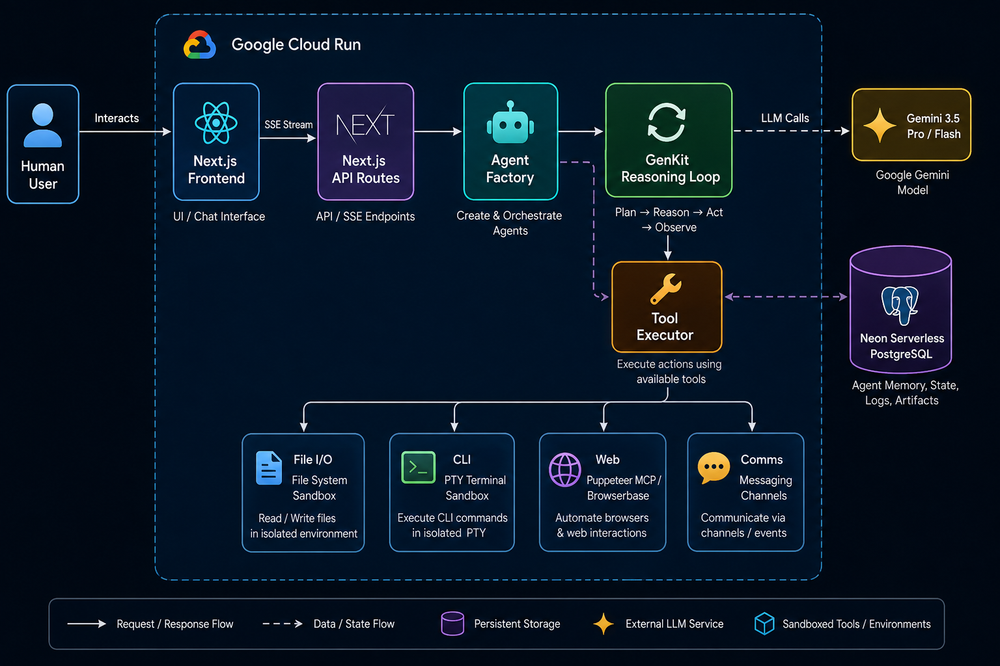

# Trans4mers Architecture & Technical Documentation

**Trans4mers** is a high-density, real-time agent orchestration workspace and AI application framework. It combines a Next.js (App Router) interface with a distributed, multi-agent reasoning engine built on Genkit (Vertex AI), PostgreSQL (`pgvector`), and Google Cloud Run.

This document breaks down the complete architecture across five major layers.

## Visual Architecture Diagram

---

## 1. Frontend Architecture & Workspace UI
The frontend provides a 3-pane IDE-like collaborative workspace where human operators and autonomous agent swarms interact via visual topologies, Slack-style communications, and human-in-the-loop workflows.

* **Tech Stack**: Next.js 16.3.3, React 19, Tailwind CSS v4 (OKLCH), Zustand 5.0, `@xyflow/react` (React Flow), `@monaco-editor/react`.
* **State Management**: A hybrid architecture using Zustand (`useOSStore`) for global UI shell panes, coupled with optimistic mutations for chat, and Server-Sent Events (SSE) for real-time swarm updates.
* **Core Components**:
  * `SwarmMap.tsx`: A dynamic DAG topology using `dagre` representing the human and active agent hierarchy. Supports drag-and-drop delegation and real-time node glowing based on agent status (`RUNNING`, `HALTED`, `IDLE`).
  * `SlackMode.tsx`: Separates public channels (`#shared-blackboard`) from 1:1 Direct Messages (`DM-<agent>`). Features embedded interactive Human-in-the-Loop (HITL) approval cards.
  * `RightSidebar.tsx`: Hosts the Monaco Code Editor, Workspace File Tree, PTY Terminal Widget, and a live Tasks stream.
* **Real-Time Data Layer**: Relies on a hybrid push/pull SSE implementation (`/api/sse`) supplemented by debounced REST API mutations.

---

## 2. Backend API & Routing Layer
The API layer executes as serverless instances on Google Cloud Run and is fully dynamic (`force-dynamic`).

* **Session & Auth**: Anonymous multi-tenant sessions are tracked via a `t4m_session` HTTP-only cookie. Access is strictly scoped using helper guards (`validateProjectAccess`, `validateConversationAccess`) returning standard 401/403/404 HTTP responses.
* **Real-Time SSE Bus**: Uses an in-memory Node.js `EventEmitter` for sub-millisecond local updates, backed by a horizontal database polling loop (every 3000ms) to ensure updates synchronize across scaled Cloud Run containers. A 15-second ping keeps connections alive.
* **Sandboxed PTY Terminal**: The `/api/pty/route.ts` endpoint provides an interactive terminal. Commands are filtered for shell injection `/[&|;$><`\n\r]/`, restricted to an allowlist (`npm`, `git`, `node`, etc.), and execute strictly within the isolated `.trans4mers-workspaces/<sessionId>/<projectId>` directory.
* **Internal APIs**: Cloud Pub/Sub webhooks (`/api/pubsub/resume`) validate Google OIDC ID tokens; internal agent triggers (`/api/internal/run-agent`) and cron jobs (`/api/cron/overseer`) enforce secret bearer tokens.

---

## 3. Database & Data Models (Prisma & pgvector)
The PostgreSQL database acts as the single source of truth for swarm orchestration, hierarchical execution, and semantic memory.

* **Core Entities**:
  * `Project` -> `Conversation` -> `AgentInstance` & `Message`.
  * `AgentInstance` supports a recursive self-relation (`parentInstanceId`), allowing parent agents to dynamically spawn and track child worker sub-agents.
  * `Channel` ensures singleton paths for `#shared-blackboard` and deterministic DM hashes.
* **Concurrency & Locks**:
  * **SystemLock**: A distributed lease-based mutex used by the Overseer cron job to prevent horizontal race conditions.
  * **FileLocks**: Granular mutexes preventing agents from corrupting files during parallel modifications.
* **Knowledge & Memory**:
  * **SharedBlackboard**: Global Key-Value whiteboard for deterministic architectural decisions.
  * **MemoryBank**: Long-term semantic memory using `pgvector` (768 dimensions via `vertexai/text-embedding-004`), accessed via raw SQL L2 distance operators (`<->`) for rapid similarity search.
* **Integrity**: Comprehensive relational cascades (`onDelete: Cascade`) guarantee zero orphaned artifacts when projects or conversations are deleted.

---

## 4. Agent Orchestration Engine
The agent execution engine leverages Genkit 3 and Gemini 2.5 Flash with a robust ReAct (Reasoning + Acting) loop.

* **ReAct Execution Loop**:
  1. **Context Hydration**: Assembles the agent's system prompt, Global Project Instructions, the Active Swarm Roster, and historical memory.
  2. **Live Steering**: Intercepts new user messages mid-reasoning by polling Prisma before passing context to the LLM.
  3. **Context Compaction**: Triggers a Gemini-generated extractive summary when history exceeds ~100k tokens, preserving recent messages and system preambles.
* **Human-in-the-Loop (HITL)**:
  * Agents executing risky tasks yield a `requestHumanApproval` tool call. The execution loop suspends itself, serializes the context to `AgentInstance.contextState`, and transitions to `HALTED`.
  * Human approval via the UI resumes the loop natively, patching the tool response with `{ approved: true }`.
* **Swarm Communication & DMs**:
  * Agents can invoke `sendDirectMessageTool` to target specific peers. This creates a `DM` channel and triggers a fire-and-forget async ReAct loop for the target agent, achieving localized autonomous delegation.
* **The Overseer**: A background cron (`Overseer.ts`) evaluates active `RUNNING` agents. If concurrency exceeds the maximum threshold, it posts an alert requiring human intervention to cull runaway swarms.

---

## 5. DevOps, Infrastructure & Security
The deployment architecture is fully cloud-native, designed to run flawlessly on Google Cloud Run with strict environment isolation.

* **Containerization**: A multi-stage Dockerfile based on `node:20-slim`. Compiles Next.js as `standalone`. Runs the production container securely under a non-root `nextjs` (uid 1001) user.
* **Dual-Mode Filesystem**: The `FileSystem.ts` adapter automatically detects Cloud Run (`K_SERVICE`) and routes read/write operations to Google Cloud Storage (GCS). Locally, it proxies to `fs/promises`.
* **Workspace Sandboxing**: All tools (`fileSystemTools`, `commandTool`) restrict execution strictly to `.trans4mers-workspaces/<sessionId>/<projectId>`. Path traversals (`../`, `/`) are forcefully rejected.
* **Security & Prompt Guards**:
  * Integrates **Google Cloud Model Armor** to sanitize user prompts before model ingestion (fail-secure design).
  * Automatically applies GCP Application Default Credentials (ADC).
  * MCP keys and plugin credentials are automatically masked from the UI and safely segregated by session (`mcp_config_<sessionId>`).

---
