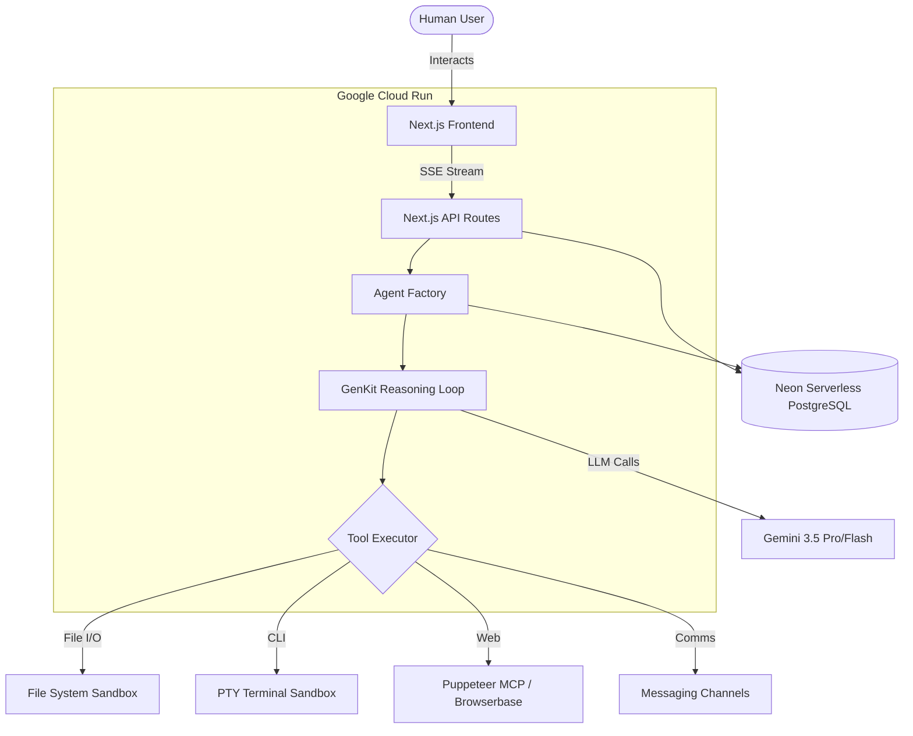

# Trans4mers: Multi-Agent Swarm OS

**Trans4mers** is a scalable, next-generation Multi-Agent Swarm OS built for the **"All Things Agentic" Hackathon**. It completely rethinks how AI agents interact with humans by moving beyond the standard chat loop.

Instead of a single isolated LLM, Trans4mers dynamically spawns specialized subagents that operate asynchronously in the background, executing complex file system operations, web research, and workflow automation safely within a sandboxed enterprise environment.

## Hackathon Tracks

### The Collaborative Partner
Trans4mers features a strict **Human-In-The-Loop (HITL)** architecture. When agents need to perform destructive actions (like executing shell commands or deleting files), they proactively halt their workflow, explain their intent, and explicitly request human approval via the UI before proceeding.

### The Fortified Enterprise Fleet
Designed for enterprise security and scale, Trans4mers is deployed on **Google Cloud Run**. It features:
- A real-time **Swarm Map** (React Flow) visualizing agent networks and execution state
- A hardened **PTY Terminal Sandbox** blocking environment variable leaks
- Cross-agent direct messaging and task delegation via Slack-style channels
- **Gemini 3.5 Pro/Flash** reasoning engine wrapped in a professional IDE-like interface
- An **Overseer Watchdog** that monitors swarm health and intervenes if agents drift

## Tech Stack

- **AI/LLM:** Google Gemini 3.5 Pro & Flash via GenKit
- **Frontend:** Next.js 16.3 (Turbopack), React 19, Tailwind CSS, Lucide Icons, React Resizable Panels
- **Backend:** Next.js App Router (API Routes), Server-Sent Events (SSE)
- **Database:** Neon Serverless PostgreSQL (Prisma ORM with pgvector)
- **Infrastructure:** Google Cloud Run (Fully Containerized via Docker)
- **Web Automation:** Browserbase (Puppeteer MCP)
- **State Management:** Zustand

## Local Development

1. **Clone the repository:**
   ```bash
   git clone https://github.com/abhayzangir1/trans4mers.git
   cd trans4mers
   ```

2. **Set up Environment Variables:**
   Copy `.env.example` to `.env.local` and fill in your actual credentials:
   ```bash
   cp .env.example .env.local
   ```

3. **Install Dependencies:**
   ```bash
   npm install
   ```

4. **Initialize Database:**
   ```bash
   npx prisma generate
   npx prisma db push
   ```

5. **Start the Dev Server:**
   ```bash
   npm run dev
   ```

6. Open [http://localhost:3000](http://localhost:3000) in your browser.

## Deployment (Google Cloud Run)

This project includes a built-in PowerShell script for instant deployment:

```powershell
.\deploy.ps1 -DbUrl "your_db_url" -BbApiKey "your_browserbase_key" -BbProjectId "your_browserbase_project_id"
```

Ensure you have `gcloud` CLI installed and authenticated to your Google Cloud project.

## Architecture



---
*Built for the All Things Agentic Hackathon*
